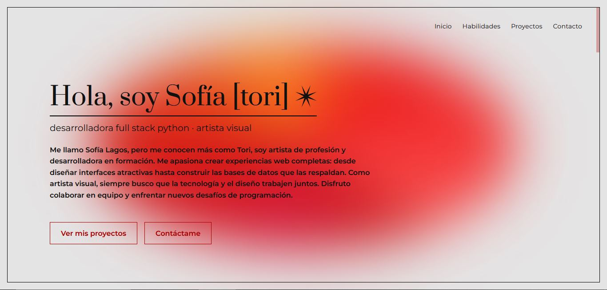
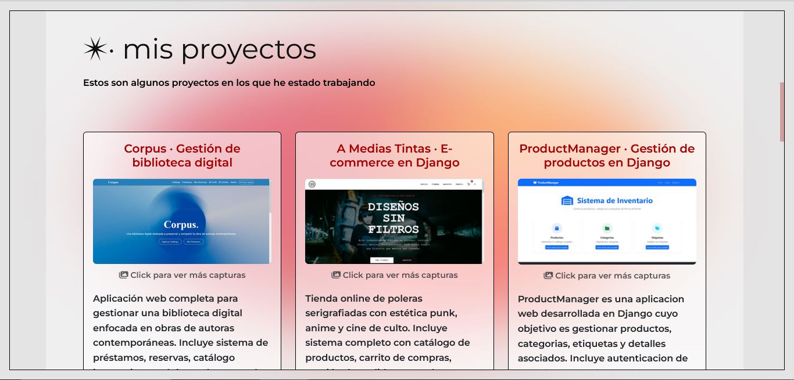
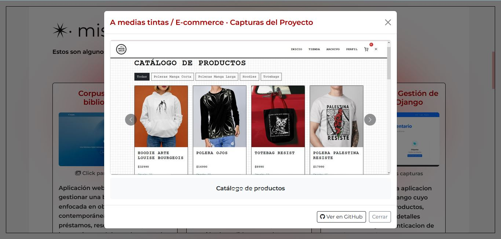
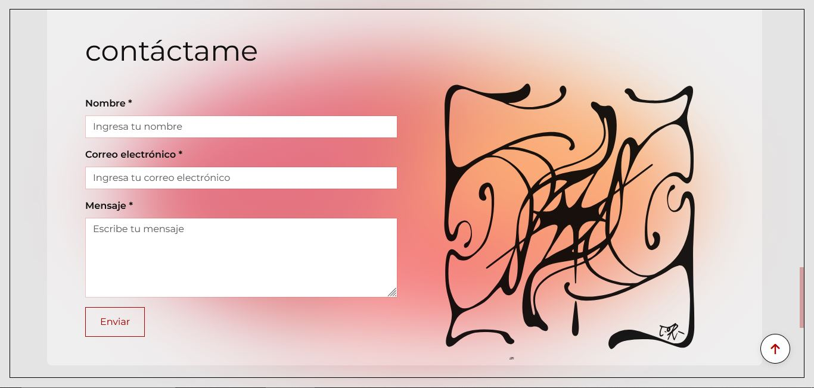

# Mi Portafolio

# ✴ Portafolio — Sofía Lagos  
**Desarrolladora Full Stack Python | Artista visual**


[]()
[]()
[]()
[]()
[]()
[](https://too0oori.github.io/Portafolio/)

---

## ✴ Descripción general

Este portafolio fue diseñado y desarrollado como una **plataforma de presentación profesional**, donde se integran mis habilidades técnicas, mi formación artística y mi enfoque conceptual en el desarrollo web.

El sitio combina **funcionalidad y diseño**, priorizando la experiencia de navegación y la coherencia visual.  
Cada sección está pensada como un espacio claro, ordenado y estéticamente consistente.

---

## ✴ Objetivo

Presentar mi perfil como **desarrolladora Full Stack Python**, mostrando dominio en el desarrollo de aplicaciones web completas — desde el backend en Django hasta la implementación visual con HTML, CSS y JavaScript — junto con un criterio de diseño profesional y una sensibilidad estética influida por mi formación artística.

---

## ✴ Arquitectura del proyecto

El sitio fue construido desde cero utilizando tecnologías base de la web moderna:

| Capa | Tecnologías y herramientas |
|------|-----------------------------|
| **Frontend** | HTML5 · CSS3 (animaciones, media queries, efectos de blur y glassmorphism) · JavaScript ES6 |
| **Backend (formativo)** | Python · Django (en proyectos asociados dentro del portafolio) |
| **Diseño y experiencia** | Responsive design · estructura semántica · tipografía Prata y Montserrat |
| **Control de versiones** | Git & GitHub |

---

## ✴ Características principales

- **Diseño encapsulado con marco negro:** navegación dentro de un límite visual claro.  
- **Animación de fondo tipo blob:** aporta movimiento y profundidad sin afectar el rendimiento.  
- **Menú hamburguesa fullscreen:** experiencia inmersiva en móviles y tablets.  
- **Scroll interno:** desplazamiento fluido con una barra sutil.  
- **Transiciones suaves y coherentes** con la identidad visual general.  
- **Botón “volver arriba”** con comportamiento inteligente dentro del contenedor principal.  
- **Footer con efecto glassmorphism** y enlaces profesionales (GitHub, LinkedIn, correo).
- **Galería de Proyectos**: Modales interactivos con carruseles de imágenes
- **Optimizado**: Carga rápida y rendimiento eficiente
- **Accesible**: Etiquetas ARIA y navegación por teclado

---

## ✴ Enfoque técnico y estético

El desarrollo se centra en tres pilares:

1. **Estructura limpia y escalable:** código modular, clases claras y reutilización eficiente de estilos.  
2. **Diseño centrado en la experiencia del usuario:** fluidez visual, tipografía legible, jerarquía clara.  
3. **Sensibilidad visual:** equilibrio entre función y forma, inspirado por mi trayectoria en artes visuales.

> _El objetivo no es solo que funcione, sino que comunique._

---

## 🚧 Desafíos y Soluciones

### Optimización del Blob Animado
Uno de los mayores desafíos fue implementar el efecto de blob animado en el fondo sin comprometer el rendimiento. Inicialmente, la animación consumía demasiados recursos del navegador.

**Solución implementada:**
- Uso de `will-change: transform` para optimizar el rendering
- Aplicación de `filter: blur()` en el contenedor padre en lugar del elemento animado
- Reducción de la complejidad del gradiente cónico
- Limitación del área de renderizado con `overflow: hidden`

### Legibilidad sobre el Fondo Dinámico
El texto sobre el blob rojo blur presentaba problemas de legibilidad y contraste, especialmente en dispositivos móviles.

**Soluciones aplicadas:**
- Implementación de `backdrop-filter: blur()` en las tarjetas y secciones
- Fondos semi-transparentes blancos (`rgba(255,255,255,0.4)`) para crear capas de separación
- Uso estratégico de bordes oscuros para definir límites visuales
- Ajuste de opacidad del blob a 0.9 para suavizar el efecto

### Sistema de Scroll y Contenedor Marco
Crear un marco negro que funcionara como contenedor real (no decorativo) mientras mantenía un scroll fluido fue complejo.

**Implementación final:**
- Cambio de `position: fixed` a `position: absolute` en el marco
- Control de overflow en `main-wrapper` en lugar de en `body`
- Scrollbar personalizado con estilos webkit para mejor visibilidad
- Ajuste de altura máxima con `calc(100vh - 2rem)` para respetar el marco

### Responsive y Adaptabilidad
El blob y el marco presentaban problemas de desbordamiento en pantallas pequeñas.

**Ajustes realizados:**
- Media queries específicos para diferentes breakpoints
- Reducción dinámica del padding en mobile
- Ajuste del tamaño del blob según viewport
- Optimización del hero section para centrado en todas las resoluciones

---

## 📁 Estructura del repositorio
```bash
portafolio/
├── index.html          # Estructura principal
├── styles.css          # Estilos personalizados
├── script.js           # Funcionalidad JavaScript
├── assets/             # Recursos multimedia
│   ├── *.JPG          # Capturas de proyectos
│   └── dibujo.svg     # Ilustración de contacto
└── README.md          # Documentación
```
---

## 🚀 Instalación y Uso

### Requisitos Previos

- Navegador web moderno (Chrome, Firefox, Safari, Edge)
- Editor de código (recomendado: VS Code)
- *(Opcional)* Live Server para desarrollo local

### Instalación Local

1. **Clona el repositorio**
```bash
git clone https://github.com/too0oori/Portafolio
cd portafolio
```

2. **Abre el proyecto**
   - Opción A: Doble click en `index.html`
   - Opción B: Con Live Server (VS Code):
     ```
     Click derecho en index.html → Open with Live Server
     ```

3. **¡Listo!** El portafolio se abrirá en tu navegador

## ✴ Vista previa

🔗 [Ver sitio en línea](https://too0oori.github.io/Portafolio/)  

## 📦 Dependencias

**CDN utilizados (sin instalación requerida):**

```html
<!-- Bootstrap 5.3.0 -->
<link href="https://cdn.jsdelivr.net/npm/bootstrap@5.3.0/dist/css/bootstrap.min.css" rel="stylesheet">

<!-- Font Awesome 6.5.1 -->
<link rel="stylesheet" href="https://cdnjs.cloudflare.com/ajax/libs/font-awesome/6.5.1/css/all.min.css">

<!-- Google Fonts -->
<link href="https://fonts.googleapis.com/css2?family=Montserrat:wght@400;600;700&family=Prata&display=swap" rel="stylesheet">
```

**No requiere npm ni instalación de paquetes.** Todo funciona con CDN para máxima portabilidad.

---

## 📸 Capturas de Pantalla

### Desktop

*Sección de inicio con blob animado*

### Proyectos


*Galería de proyectos con modales interactivos*

### Contacto

*Sección de contacto con iluistración*

### Responsive

*Vista móvil adaptativa*

## 🎯 Proyectos Destacados

### 1. Corpus - Gestión Bibliotecaria
Sistema completo para biblioteca digital con Django, SQLite y Bootstrap.
- [Ver código](https://github.com/too0oori/M6_EvaluacionPortafolio_Sof-aLagos)

### 2. A Medias Tintas - E-commerce
Tienda online de poleras serigrafiadas con carrito y gestión de pedidos.
- [Ver código](https://github.com/too0oori/M7_Portafolio_SofiaLagos)
- [Ver sitio](https://a-medias-tintas-e-commerce.onrender.com/)

### 3. ProductManager
Gestor de productos con PostgreSQL y operaciones CRUD completas.
- [Ver código](https://github.com/too0oori/M7_EvaluacionModulo_Sofia)

## 🔄 Funcionalidades Interactivas

- **Navegación suave**: Scroll animado entre secciones
- **Menú responsive**: Hamburguesa en móvil con overlay
- **Modales de proyectos**: Carruseles de capturas
- **Botón back-to-top**: Aparece al hacer scroll
- **Hover effects**: Animaciones en tarjetas y botones
- **Formulario de contacto**: Validación básica

---

## ✴ Sobre mí

Soy **Sofía Lagos**, desarrolladora **Full Stack Python** con formación como **Artista Visual**.  
Combino pensamiento analítico y sensibilidad visual para construir proyectos donde el diseño y la funcionalidad se encuentren.

Me interesa trabajar en entornos que integren **tecnología, educación, cultura y experiencia digital**, aportando tanto en la parte técnica como en la conceptual.

> _Busco crear código que funcione bien, se lea claro y también se sienta vivo._

---

## 📬 Contacto

- 📧 **sofia.lagos.cesped@gmail.com**  
- 🐙 [GitHub](https://github.com/too0oori)  
- 💼 [LinkedIn](www.linkedin.com/in/sofía-lagos-césped)

---

**Hecho con ❤️ y mucho ☕ por Sofía [tori]**

**© 2025 Sofía Lagos — Portafolio profesional Full Stack Python**


